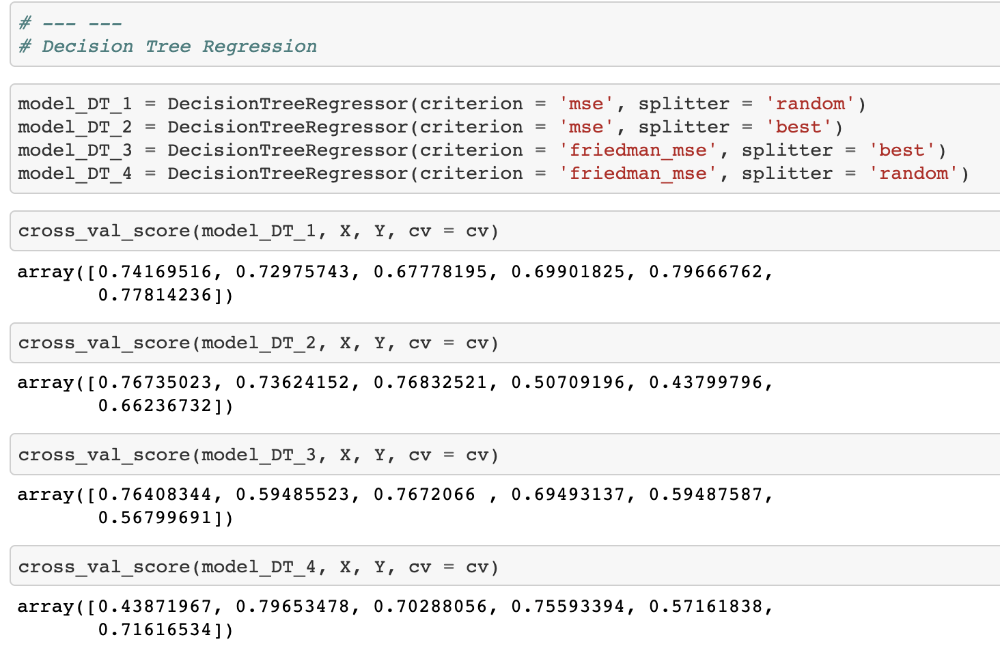

# Price prediction of houses based on neighborhood.

## Basic Overview:

* **Goal**: Create a model that helps potential home buyers to estimate the price of homes in a particular city.

* The prices of homes can fluctuate depending on the number of bedrooms and bathrooms, the location and the histroic growth of the housing market. This project tries to take into account all the attributes that influences the home pricing and give these attributes the fair weight that they use to influence the pricing.

* We tested multiple algorithms and picked Linear Regression as the algorithm of choice to build our model.

## Why Linear Regression?

* Linear regression is one of the easiest regression algorithm to understand. However, there are other strong algorithhms that can build price prediction models. We tested such algorithms as Decision Tree & Lasso Regression.

* The data preparation effort ensured the linear regression algorithm was fed the right attributes. This preperation enabled linear regression to give the best results and accuracy.

* Linear regression algorithm also ensures a very straightforward explanation of how the housing price model works.

## Resources and code used:

* ***Python Version***: 3.8
* ***Packages***: Pandas, Matplotlib, NumPy, Pickle, Sklearn (Linear Regression, Lasso, Decision Tree, train_test_split)
* ***Data Source***: https://www.kaggle.com/amitabhajoy/bengaluru-house-price-data

## Data Acquisition:

* Used data from kaggle (https://www.kaggle.com/amitabhajoy/bengaluru-house-price-data).
* The reason for choosing this housing dataset is because it provides a great opportunity to practice data cleaning and feature engineering.
* Original data consists of about 13320 rows and 9 columns.

## Data Cleaning:

  ### Attribute Selection & data preperation:
    
    * With general knowledge of what attributes (availability data, number of balconies etc.) would definitely not help in price prediction were dropped
    * NaN values were dropped as it made less than 1% of the dataset.
    * Unique values that were repeated in different nomenclature in the attributes were standardized.
    * Peoperties that had extreme outliers (43 bedroom house with one bathroom) were dropped.
    * New attributes such as 'Price per square feet' and neighborhood (through cleanup of the attribute) were created.
    

## Visualization:

* In order to make sure the data after an exhaustive cleanup had a normalized feel to it the following visualization was the result:

* Looking at the visualizations it seemed safe to move forward with one hot encoding.

## One Hot Encoding:

* Algorithms need to work with numbers to work. Therefore, one-hot-encoding was necessary in converting the qualatitaive data to quantitative.
* Therefore, the location attribute was converted

From:

To:

## Model Building:

* 3 algorithms were tested to build the model - Linear Regression, Lasso, and DecisionTree.
* The following are the results of each algorithm:
* Linear Regression:

* Lasso:

* Decision Tree:

## Conclusion:

* With the silhouette method and clustering analysis through visualization we have two models at hand.
* The models equally perform well but are designed to serve a comprehensive operation by using PCA and IQR standardized data.
